# 快速开始

> 通过本文您可以快速了解以下内容：
> - 如何配置应用数据源
> - 如何设计、构建应用页面和功能
> - 如何发布应用

本文主要介绍如何通过DataGo创建一个图书管理系统，并实现图书的新增和查询功能。

完成后的图书管理系统如图所示：
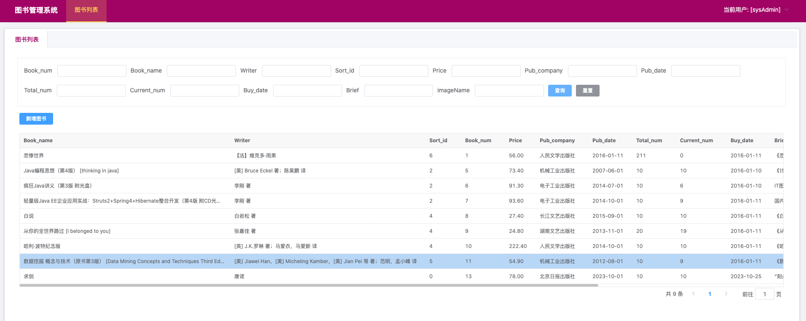

## 环境准备

### 数据库
DataGo支持连接多种类型的数据源（MySQL、Oracle、SQL Server、PostgreSQL、MongoDB、HTTP等）本文中将采用MySQL作为图书管理系统应用的数据源。

**请部署好你喜欢的数据库，并确保DataGo可以访问。**

### DataGo
请前往http://datago.cc/xxx 下载DataGo，并参考文档进行安装部署和启动

启动后通过Web浏览器访问应用 http://localhost:8081/

## 数据源配置

> 图书管理系统需要一张数据表来存储图书数据，所以我们需要在DataGo系统中添加事先准备好的数据源，并在后续的配置中将该数据源和图书管理系统应用关联起来。

首先，我们使用管理员账号登录系统，点击顶部【配置】菜单，选择【数据源】，点击【新增数据源】

填写数据库信息后，点击【确定】按钮进行保存
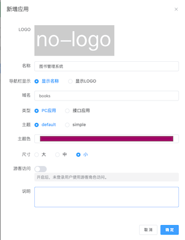

## 构建应用

> 在DataGo中，不同的应用具有各自独立的页面、功能、文件、权限配置，以及独立的子域名作为应用入口。这里我们创建一个名为图书管理系统的应用。

### 创建应用
点击顶部【应用】菜单，打开应用列表，点击【新建应用】

填写信息后，点击【确定】按钮进行保存

创建成功后，可以通过点击访问按钮来访问应用
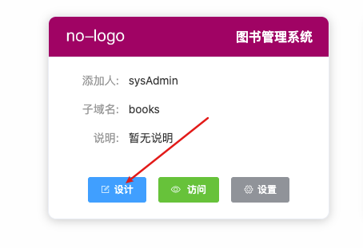

此时应用将会呈现一个空白页面
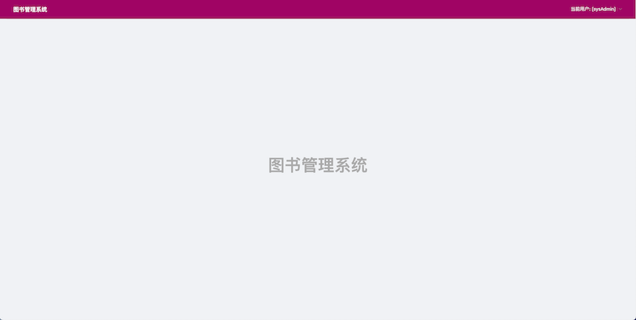

### 设计应用

> 在设计页面，我们可以给应用添加页面、表单、功能等，以及设置应用的访问权限。

在应用列表找到刚才创建的"图书管理系统"，点击【设计】进入应用设计界面。
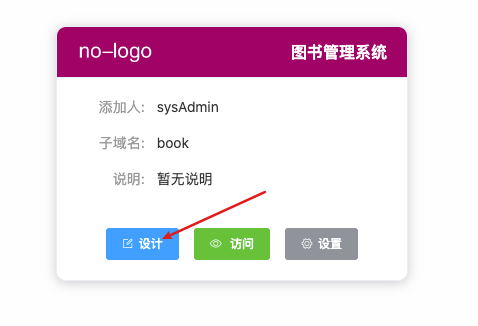

------
#### 创建图书列表页面
1. 点击左侧【新增】，输入名称“图书列表”，点击【保存】。
   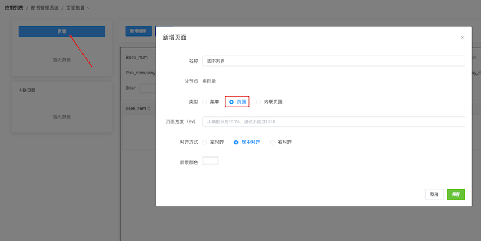

2. 选择左侧的“图书列表”菜单，点击【新增组件】,选择“表格”。
   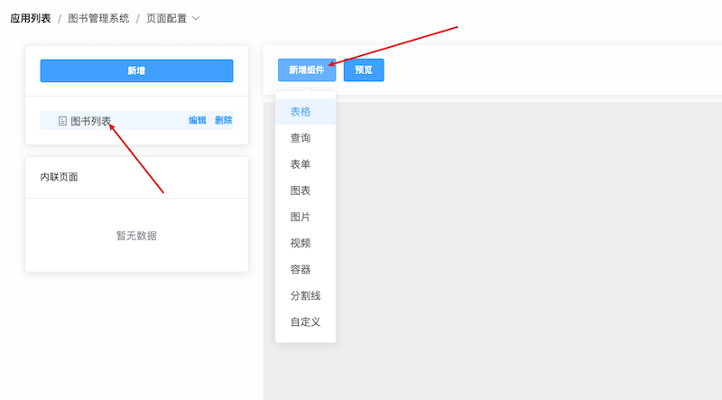

3. 点击表格组件右上角的【编辑】菜单打开表格组件编辑窗口。
   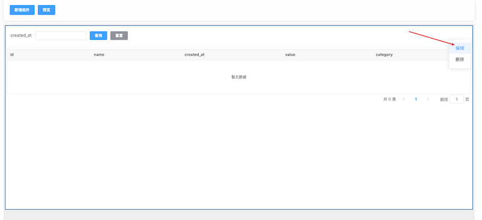

4. 设置表格的数据配置，选择对应的数据源及数据库books下面的t_book表后，点击【生成】按钮
   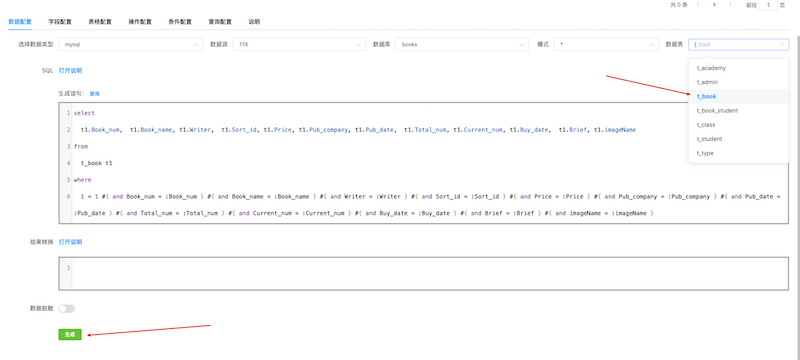

5. 点击上方【查询】按钮，可以实时查看返回结果，确认结果ok后，点击右上角X,关闭窗口。
   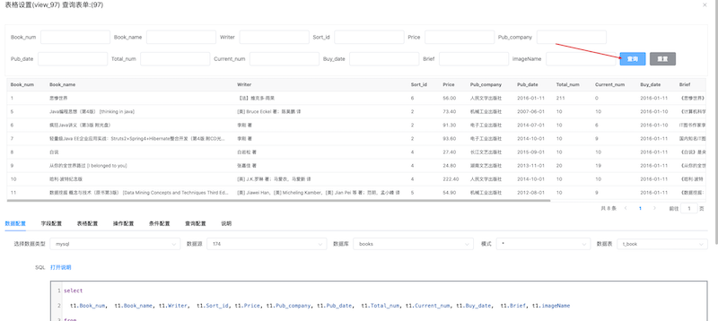

------
####  创建图书新增页面
1. 点击应用设计页面左侧“新增”，这里选择【内联页面】，输入名称“添加图书表单”，点击【保存】。
   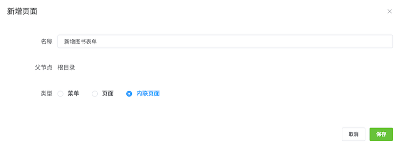

2. 点击左侧“新增图书表单”，在右侧点击【新增组件】,选择【表单】。组件创建后，选择表单组件右上角的编辑菜单打开编辑窗口。
   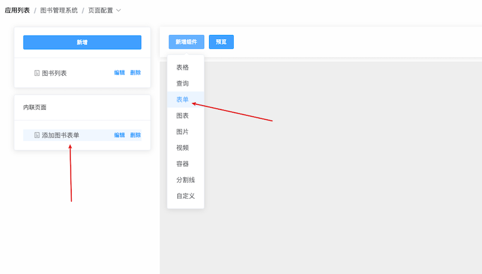

3. 在表单编辑窗口，点击【字段配置】标签页，点击【通过数据表生成】后选择对应的数据源-》数据库-》t_book表。这样就得到了图书信息的所有字段
   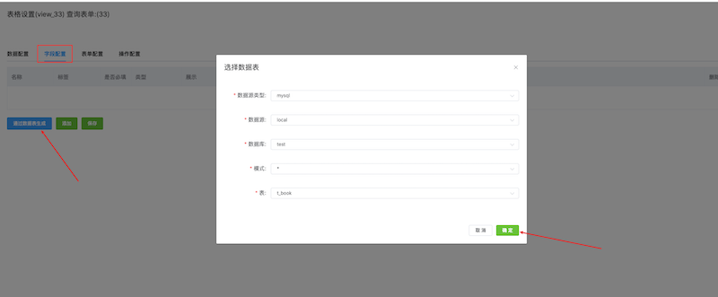
   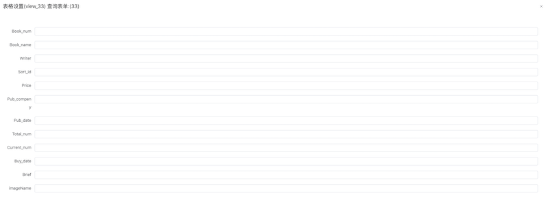

4. 修改字段标签为中文，修改对应的表单类型，例如Buy_date 设置为展示类型设置为“日期”类型，完成后点击下方【保存】按钮。
   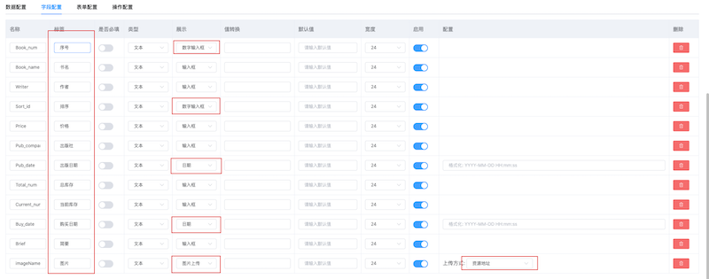

------
#### 创建图书新增操作
1. 返回应用设计界面，点击【页面配置】打开下拉菜单，选择【功能配置】菜单点击进入。
   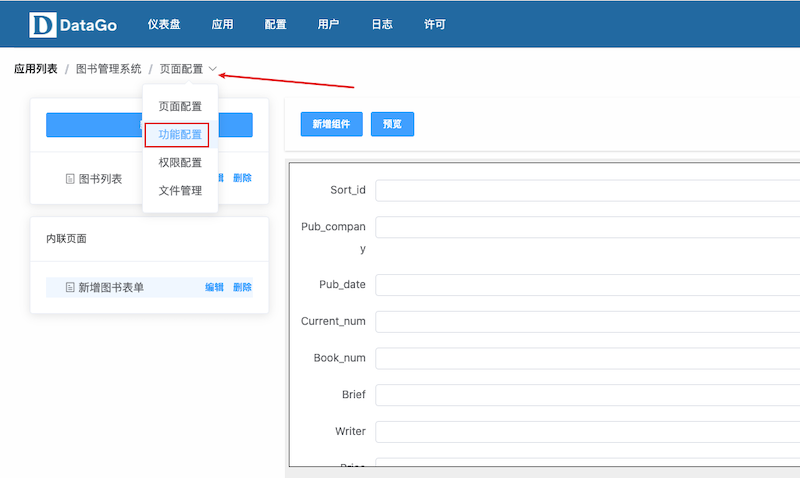

2. 点击【新增功能】选择数据源-》数据库-》t_book表，默认自动生成insert语句，点击【生成】按钮。
   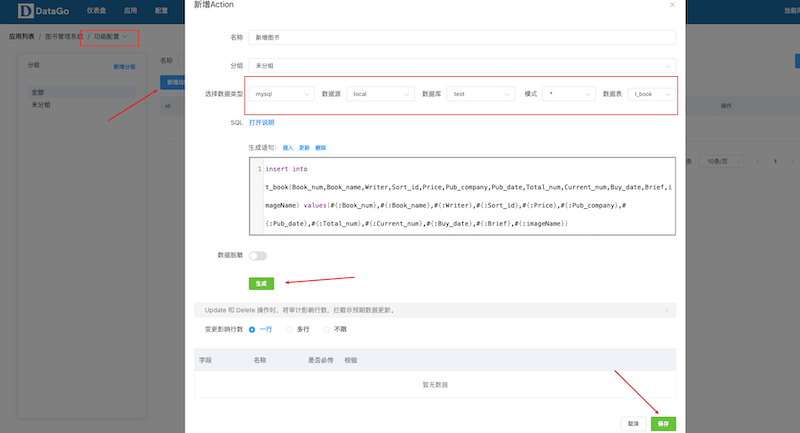

3. 下拉查看字段，把所有字段设为必传。点击【保存】。
   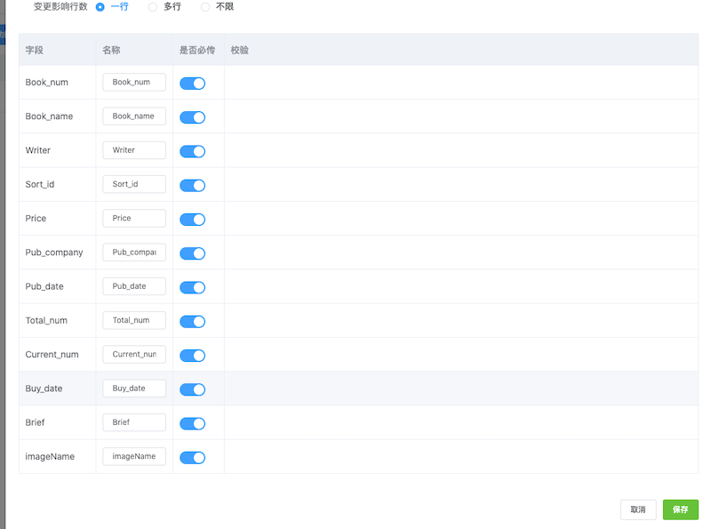

4. 点击【功能配置】在弹出子菜单里选择【页面配置】返回应用设计->页面配置。
   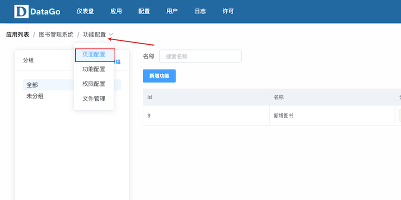

------
#### 关联图书新增操作
1. 点击左侧的“新增图书表单”菜单，点击右侧表单组件右上角的【编辑】打开编辑窗口。
   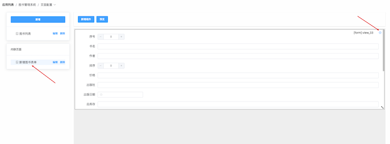

2. 进入编辑窗口，打开【操作配置】标签，点击【新增】按钮，新增项里： “lable”修改为保存，“目标”选择功能，目标id选择刚才新建的“新建图书”操作，最后点击【保存】按钮。
   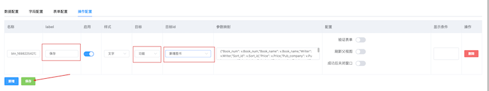

------
#### 关联图书新增页面
1. 进入应用设计界面，点击左侧的“图书列表”菜单后，选择右侧组件右上角的【编辑】打开编辑窗口。
   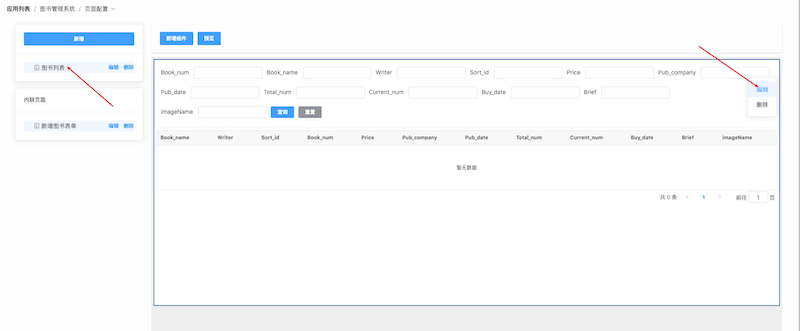

2. 打开组件编辑窗口后，选择下方的【操作配置】标签页，点击下方【新增】按钮，新增项: lable填写“新增图书”，目标类型选择页面，目标id选择“新增图书表单”，数据配置选择"无“，页面打开方式选择”弹窗“。设置完成后，点击下方【保存】，后点击右上角的X关闭编辑窗口。
   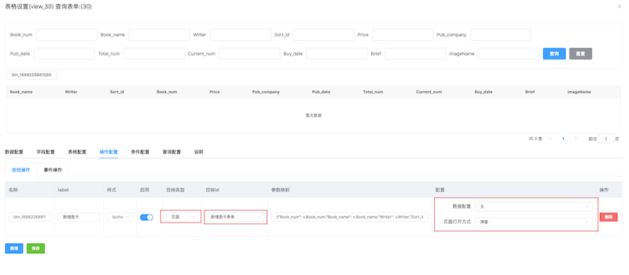

3. 点击上方的【预览】按钮，页面功能进行测试。
   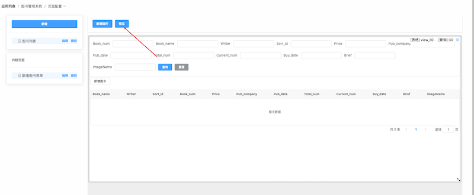

4. 预览页面（新窗口）：点击查询，显示图书列表，点击【新增图书】按钮。
   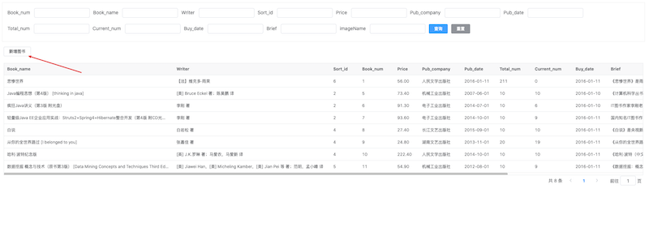

5. 在豆瓣上找到一个图书详情（https://book.douban.com/subject/36578060/），复制信息填写到表单，点击【保存】。
   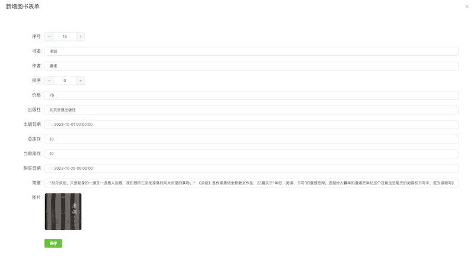

6. 保存后，弹窗会自动关闭，再次查询，看到刚才的新增”求剑“的信息出现在列表末尾。
   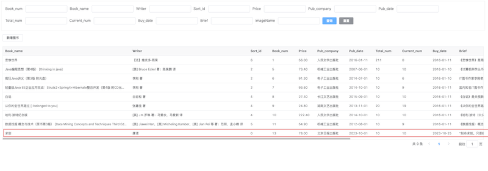

------
#### 应用访问权限设定
1. 点击顶部”应用“菜单，进入应用列表，选择”图书管理系统“，点击【访问】，如果设置了子域名（books），这里会多出来一个子域名访问，使用子域名访问。
   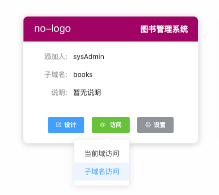

2. 子域名地址：[http://books.datago.sqldev.info/#/default  ](http://books.datago.sqldev.info/#/default)  
   目前这个地址只能管理员自己访问，其他人访问需要授权。下面介绍如何授权，这里以"游客模式"授权为例。
   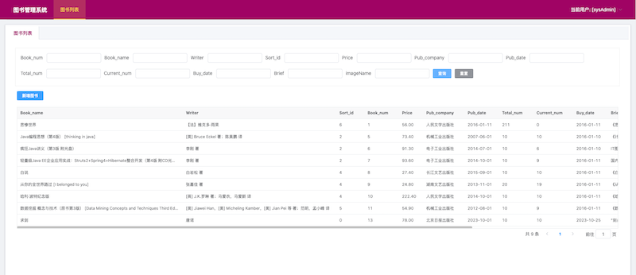

3. 返回应用列表，选择”图书管理系统“，点击【设置】->【编辑】
   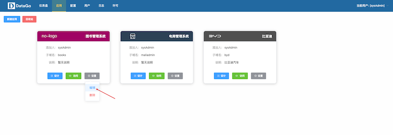

4. 设置窗口里打开【游客模式】，点击【确定】。
   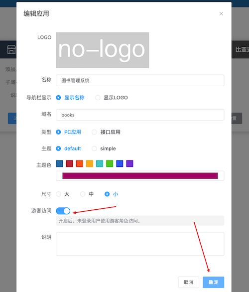

5. 选择”图书管理系统“，选择【设计】进入应用设计界面。
   

6. 点击上方【页面设置】选择下拉项中的【权限配置】进入权限配置界面。
   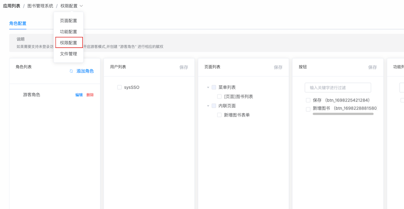

7. 看到已经有了一个“游客角色”，这个角色会自动赋给未注册登录的用户，只有在应用开启“游客访问模式”生效，选中游客角色，对模块下的项目进行勾选，点击【保存】。
   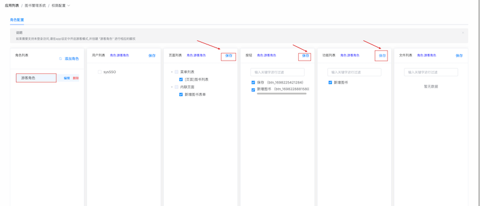

8. 使用Chrome打开无痕窗口，输入地址：http://books.datago.sqldev.info/#/default 右上角用户显示是guest。此时，应用可以任意用户访问。 
   如果仅允许注册用户访问，需要关闭【游客模式】，然后在【权限配置】创建新角色，配置用户和权限后【保存】就可以了。
   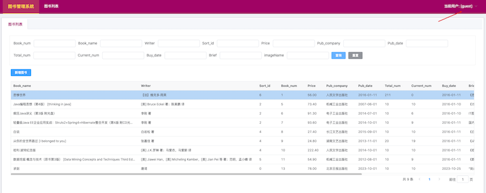

## 附录：

### 名词解释

- 数据源：数据库或 HTTP 接口。

- 应用：使用 DataGo 构建的独立应用，可以使用子域名访问，具有独立的权限系统。

- 页面：
	- 菜单：应用的菜单目录。
	- 页面：应用的菜单及页面。
	- 内联页面：不在主菜单挂靠的页面，通常用来做数据新增、编辑及预览。表现形式多为弹窗、新页面。

- 组件：
	- 表格：支持分页的表格数据组件。
	- 查询：查询表单组件可触发多个数据组件。
	- 表单：详情预览或编辑新增数据组件。
	- 图表：图表组件。
	- 自定义：基于 HTML 或 Vue 脚本自由扩展的组件。

- 功能：用于配置脚本和参数，通常用于数据变更。

- 权限：可通过角色设定用户、页面、按钮、功能及文件对应的操作权限。

- 文件：应用下面的文件，分为：
	- 私有资源（保存图片、PDF 及视频等文件，需设置权限访问）
	- 公有资源（应用级资源文件 JS 脚本，图片及 CSS 脚本等,无权限限制）
	- 用户资源（应用用户上传的图片及其他文件，无权限限制）